# CAT Car Renting Service — Sprint 3

CAT Car Renting Service es una aplicación web orientada a la digitalización de un servicio de renting automotriz.

En este Sprint 3, el proyecto evoluciona desde la estructura desarrollada en los sprints anteriores hacia una aplicación Angular conectada a Firebase, sustituyendo la dependencia funcional de JSON-Server por un backend basado en Firebase Authentication y Cloud Firestore.

---

## Descripción del proyecto

Digitalización del servicio de renting automotriz mediante una plataforma web escalable.

La aplicación permite consultar vehículos, visualizar sus características, acceder a información corporativa, realizar acciones de contacto/reserva y gestionar usuarios mediante registro, inicio de sesión y recuperación de contraseña.

---

## Objetivos del Sprint 3

- Migrar la web a Angular.
- Convertir la estructura previa en componentes y servicios.
- Integrar Firebase como backend, eliminando la dependencia de JSON-Server.
- Gestionar usuarios con Firebase Authentication.
- Cargar datos dinámicos desde Firestore.
- Validar formularios con Angular.

---

## Tecnologías utilizadas

- Angular
- TypeScript
- Firebase Authentication
- Cloud Firestore
- Bootstrap
- RxJS
- HTML5
- CSS3
- Git / GitHub

---

## Instalación

Para ejecutar el proyecto es necesario tener instalados previamente:

- Node.js
- npm
- Git

Una vez clonado el repositorio, instalar las dependencias con:

```bash
npm install
```

## Ejecución

Para iniciar la aplicación en local:

```bash
ng serve
```

La aplicación estará disponible en:

http://localhost:4200/

## Tour técnico de la aplicación

En este Sprint 3, la aplicación se ha migrado a Angular y se conecta con Firebase para gestionar autenticación, datos dinámicos y registros generados desde formularios.

El siguiente recorrido muestra las páginas principales de la aplicación, el componente Angular asociado, el servicio que alimenta los datos, su relación con Firebase y la funcionalidad demostrable en cada caso.

---

### 1. Página principal

**Página visitada:** Home / página principal  
**Componente Angular usado:** `HomePageComponent`  
**Componentes relacionados:** `HeaderComponent`, `FooterComponent`, `FeaturedCarouselComponent`, `OfferCardComponent`  
**Servicio que alimenta los datos:** `ApiService`, `SessionService`  
**Relación con Firebase:** obtiene datos dinámicos de vehículos y empresa desde Cloud Firestore.  
**Funcionalidad demostrable:** muestra la entrada principal de la web, vehículos destacados y navegación común reutilizada en toda la aplicación.

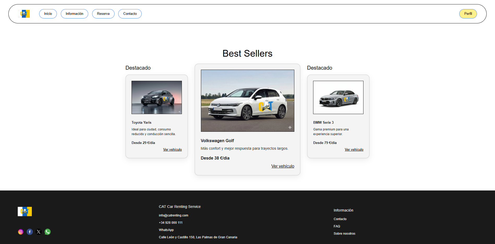

---

### 2. Catálogo de vehículos

**Página visitada:** Catálogo / sección de vehículos  
**Componente Angular usado:** `HomePageComponent` con componentes de tarjetas de vehículo  
**Componentes relacionados:** `FeaturedCarouselComponent`, `OfferCardComponent`  
**Servicio que alimenta los datos:** `ApiService`  
**Relación con Firebase:** lectura de la colección `cars` en Cloud Firestore.  
**Funcionalidad demostrable:** los vehículos se cargan dinámicamente desde Firebase, sustituyendo el uso funcional de `db.json` y JSON-Server.

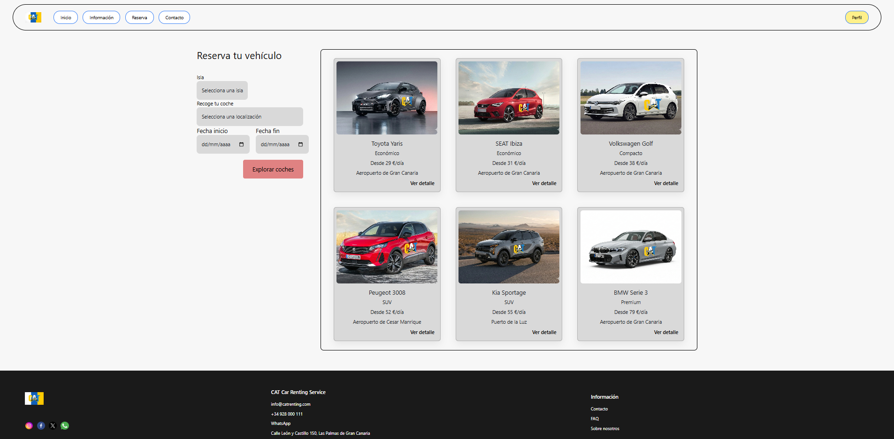

---

### 3. Ficha técnica del vehículo

**Página visitada:** Detalle de vehículo  
**Componente Angular usado:** `CarDetailPageComponent`  
**Servicio que alimenta los datos:** `ApiService`  
**Relación con Firebase:** lectura de un documento de la colección `cars` en Cloud Firestore.  
**Funcionalidad demostrable:** muestra los datos concretos de un coche, como marca, modelo, categoría, combustible, transmisión, plazas, condiciones, imagen y precio por día.

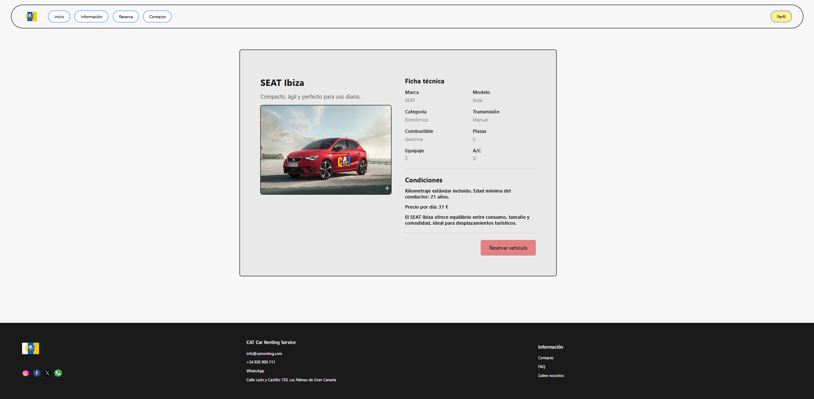

---

### 4. Registro de usuario

**Página visitada:** Registro  
**Componente Angular usado:** `AuthPageComponent`  
**Componente reutilizable:** `AuthCardComponent`  
**Servicio que alimenta los datos:** `AuthService`, `SessionService`  
**Relación con Firebase:** creación de usuario en Firebase Authentication y perfil complementario en la colección `users` de Cloud Firestore.  
**Funcionalidad demostrable:** permite crear una cuenta real con email y contraseña, validando el formulario antes del envío.

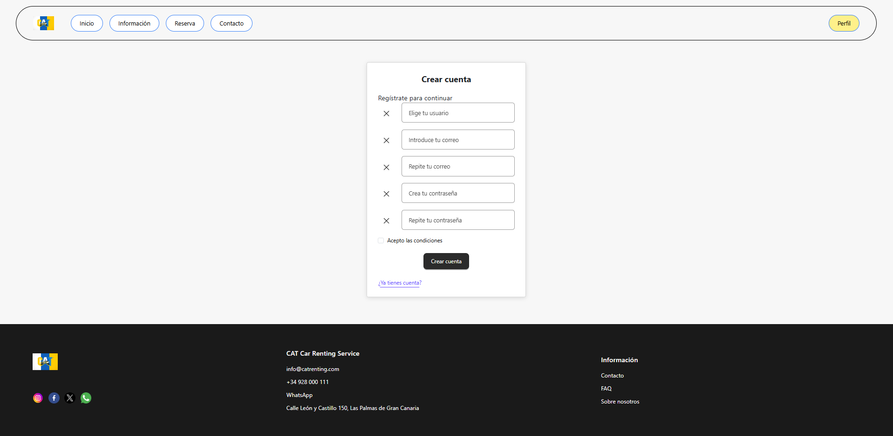

---

### 5. Inicio de sesión

**Página visitada:** Login  
**Componente Angular usado:** `AuthPageComponent`  
**Componente reutilizable:** `AuthCardComponent`  
**Servicio que alimenta los datos:** `AuthService`, `SessionService`  
**Relación con Firebase:** validación de credenciales mediante Firebase Authentication.  
**Funcionalidad demostrable:** permite iniciar sesión con un usuario creado previamente y actualizar el estado de sesión de la aplicación.

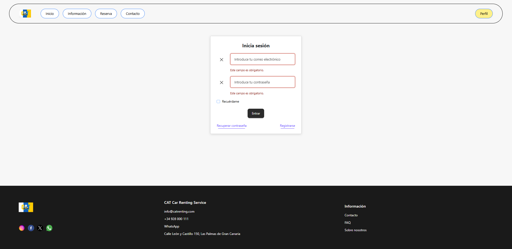

---

### 6. Recuperación de contraseña

**Página visitada:** Recuperación de contraseña  
**Componente Angular usado:** `AuthPageComponent`  
**Componente reutilizable:** `AuthCardComponent`  
**Servicio que alimenta los datos:** `AuthService`  
**Relación con Firebase:** uso del sistema de recuperación de contraseña de Firebase Authentication.  
**Funcionalidad demostrable:** permite solicitar el envío de un correo de recuperación a una cuenta registrada.

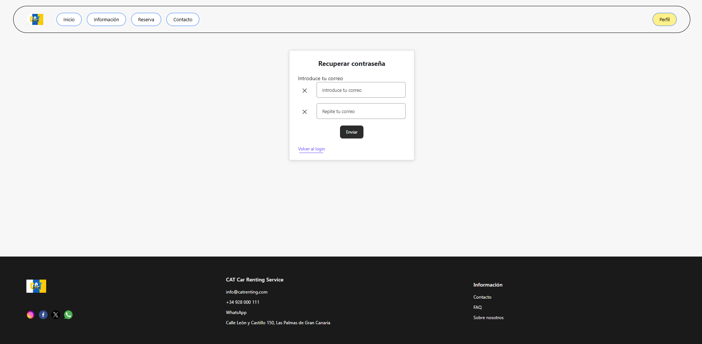

---

### 7. Página de reserva

**Página visitada:** Reserva  
**Componente Angular usado:** `ReservationPageComponent`  
**Servicio que alimenta los datos:** `ApiService`, `SessionService`  
**Relación con Firebase:** escritura de solicitudes en la colección `reservations` de Cloud Firestore.  
**Funcionalidad demostrable:** el usuario puede completar una solicitud de reserva y guardar la información en Firebase.

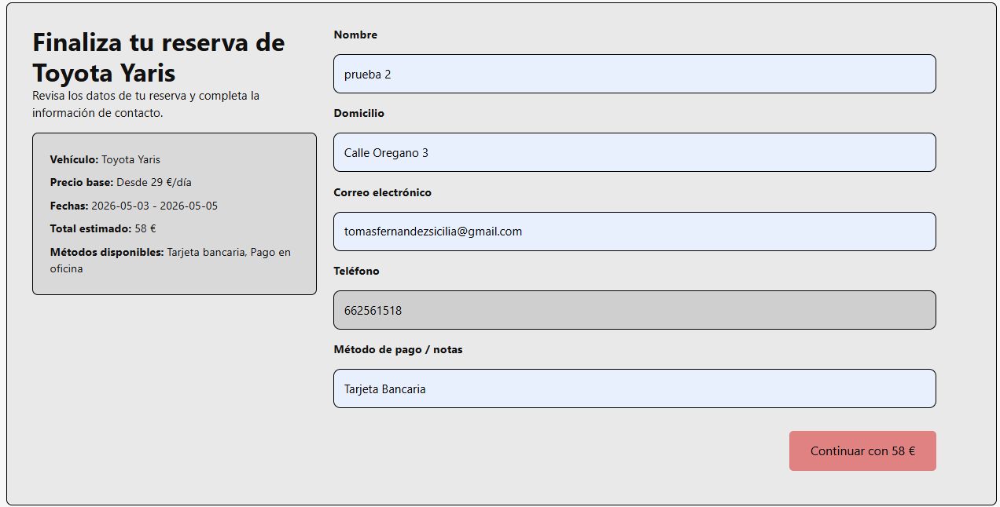

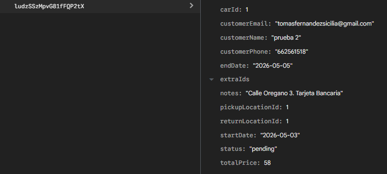

---

### 8. Página de contacto

**Página visitada:** Contacto  
**Componente Angular usado:** `ContactPageComponent`  
**Servicio que alimenta los datos:** `ApiService`  
**Relación con Firebase:** escritura de mensajes en la colección `contactMessages` de Cloud Firestore.  
**Funcionalidad demostrable:** el usuario puede enviar un mensaje desde un formulario validado y almacenarlo en Firebase.

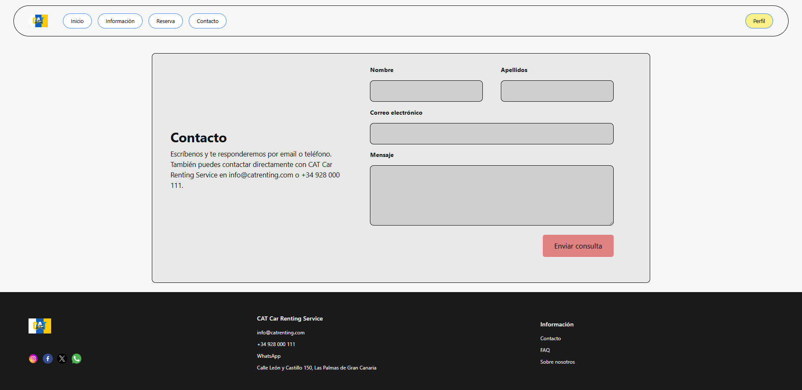

---

### 9. Página de información

**Página visitada:** Información corporativa  
**Componente Angular usado:** `InformationPageComponent`  
**Componente relacionado:** `InfoCardsComponent`  
**Servicio que alimenta los datos:** `ApiService`  
**Relación con Firebase:** lectura de datos corporativos desde colecciones como `company` y `faq` en Cloud Firestore.  
**Funcionalidad demostrable:** muestra información de empresa, historia, ubicación y preguntas frecuentes cargadas de forma dinámica.

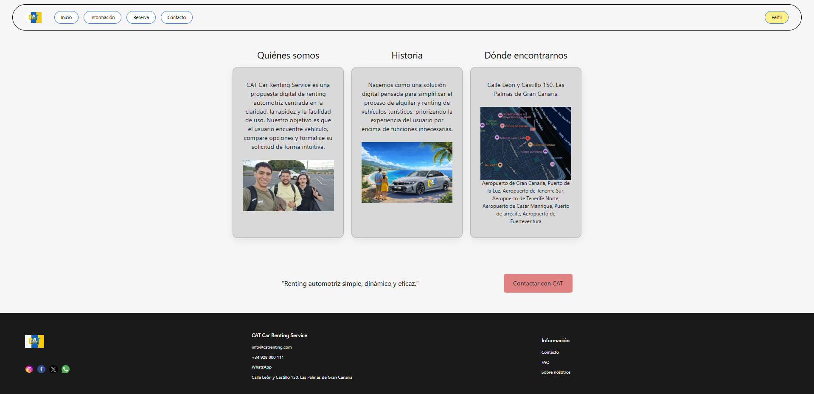

---

### 10. Header y navegación común

**Página visitada:** Todas las páginas  
**Componente Angular usado:** `HeaderComponent`  
**Servicio que alimenta los datos:** `SessionService`, `ApiService`  
**Relación con Firebase:** utiliza el estado del usuario autenticado para adaptar la navegación.  
**Funcionalidad demostrable:** el header se reutiliza en toda la aplicación y permite diferenciar la navegación según haya sesión iniciada o no.

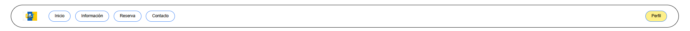

---

### 11. Footer común

**Página visitada:** Todas las páginas  
**Componente Angular usado:** `FooterComponent`  
**Servicio que alimenta los datos:** `ApiService`  
**Relación con Firebase:** puede mostrar información corporativa obtenida desde los datos de empresa.  
**Funcionalidad demostrable:** reutilización de una estructura común de cierre en toda la aplicación, evitando duplicación de código.

